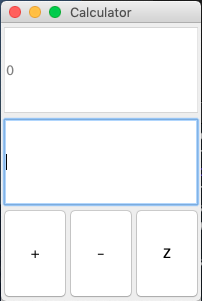
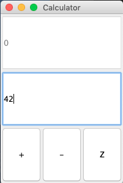
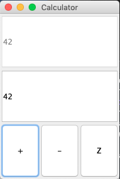

# Calculator

This is a basic calculator using java's Swing Framework. 
The project is separated into three portions following the MVC methedology.
*Note I did not use version control for this project because it is a small, experimental project
 for fun and forgot to use it.*





## Model
### Calculator.java
The calculator class supports basic operations. The calculator only perform integer operations.
There is only one property to hold the value. 
The methods are add(int), subtract(int), clear(), and getValue().


## View
### UserInterface.java
This file contains the main code to run the GUI. We set GridLayout where there are 3 rows and 1 column.
The first two rows contain the output and input text areas. The last row contains a JPanel to hold 
another GridLayout to contain 1 row and 3 columns for the different operations. The last row is it's own 
class, OperationPanel.

### OperationPanel.java
This is the last row in the Container. The OperationPanel class extends the JPanel class. Since this
panel contains all the action buttons, we need to save the properites JTextField inputs and outputs. 
Additionally, we need to have a Model Calculator instance to act upon those operation events. We create
three JButtons--one for each operation, add, subtract, and clear. 


## Controller
In the controller, we put all the event handlers for the Actions, i.e. Buttons, from the View.
Since all classes essentially need to contain the same references to the input and output textareas and
operate on the same Calculator instance, there would be a lot of shared code if we created seperate concrete
classes on their own. The only difference would be the action performed on the button. 

We can instead use an abstract class that implements the ActionListener. The abstract class holds the references 
to the input and output TextArea and the Calculator references. We set the interface method as abstract to allow 
the concrete classes implement it. 

Essentially, each button requires an operation to be performed. So we use an abstract class to use polymorphism 
for different operations.

### Operation.java
This is the abstract class that implements the ActionListener interface used to listen for and handle events.
This class is mainly used for holding the references that all the subclasses need.

This is the constructor: 
```java
public Operation(Calculator calculator, JTextField input, JTextField output) {
  this.calculator = calculator;
  this.input = input;
  this.output = output;
}
```

### AdditionOperation.java
This class performs the Addition operation. Basically, it takes the input value from JTextField and adds it to 
the calculator instance value, then outputs it onto the corresponding JTextField.

### SubtractionOperation.java
This class performs the Subtraction operation. It takes the input value from the JTextField, subtracts it from
the calculator instance value, and output it onto the JTextField again.

### ClearOperation.java
This class clears JTextField output area. Upon clicking, it will simply reset the calculator instance value to zero
and update the output JTextField area.


